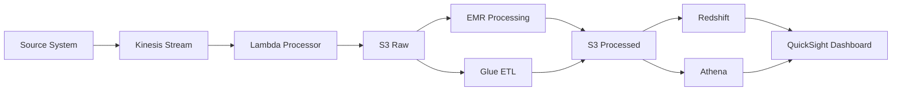

# Data Flow Architecture

## Overview

The AWS Data Platform implements multiple data flow patterns to handle different types of workloads, from real-time streaming to large-scale batch processing. This document describes how data moves through the platform from ingestion to consumption.

## Data Flow Patterns

### 1. Real-Time Flow (Hot Path)

```
Source → Kinesis → Lambda → DynamoDB → API/Dashboard
                     ↓
                   S3 (Archive)
```

**Use Cases:**
- Live dashboards
- Real-time alerts
- Fraud detection
- IoT telemetry

**Latency:** < 1 second

### 2. Near Real-Time Flow (Warm Path)

```
Source → Kinesis → Firehose → S3 → Glue → Athena → QuickSight
                                       ↓
                                   Redshift
```

**Use Cases:**
- Operational reporting
- Business metrics
- User analytics
- A/B testing

**Latency:** 1-5 minutes

### 3. Batch Flow (Cold Path)

```
Source → S3 → EMR → S3 (Processed) → Redshift → QuickSight
               ↓
           Glue ETL
```

**Use Cases:**
- Daily reports
- Historical analysis
- Data science
- ML training

**Latency:** Hours to days

## Data Ingestion Patterns

### Stream Ingestion

```python
# Kinesis Producer Library Pattern
import boto3
import json
from datetime import datetime

class StreamIngestion:
    def __init__(self, stream_name):
        self.kinesis = boto3.client('kinesis')
        self.stream_name = stream_name

    def ingest_event(self, event_data):
        """Ingest single event to stream"""
        record = {
            'timestamp': datetime.utcnow().isoformat(),
            'data': event_data,
            'metadata': {
                'source': 'application',
                'version': '1.0'
            }
        }

        response = self.kinesis.put_record(
            StreamName=self.stream_name,
            Data=json.dumps(record),
            PartitionKey=event_data.get('user_id', 'default')
        )

        return response['ShardId']
```

### Batch Ingestion

```python
# S3 Batch Upload Pattern
import boto3
import pandas as pd
from datetime import datetime

class BatchIngestion:
    def __init__(self, bucket_name):
        self.s3 = boto3.client('s3')
        self.bucket_name = bucket_name

    def ingest_batch(self, dataframe, dataset_name):
        """Upload batch data to S3"""
        # Partition by date
        date = datetime.utcnow()
        key = f"raw/{dataset_name}/year={date.year}/month={date.month:02d}/day={date.day:02d}/data.parquet"

        # Convert to Parquet
        buffer = io.BytesIO()
        dataframe.to_parquet(buffer, index=False)

        # Upload to S3
        self.s3.put_object(
            Bucket=self.bucket_name,
            Key=key,
            Body=buffer.getvalue(),
            Metadata={
                'records': str(len(dataframe)),
                'columns': ','.join(dataframe.columns),
                'ingestion_time': datetime.utcnow().isoformat()
            }
        )
```

### API Ingestion

```python
# REST API Ingestion Pattern
from fastapi import FastAPI, HTTPException
from pydantic import BaseModel
import boto3

app = FastAPI()
kinesis = boto3.client('kinesis')

class Event(BaseModel):
    event_type: str
    user_id: str
    data: dict

@app.post("/ingest")
async def ingest_event(event: Event):
    """REST endpoint for data ingestion"""
    try:
        response = kinesis.put_record(
            StreamName='maindatastream-prod',
            Data=event.json(),
            PartitionKey=event.user_id
        )
        return {"status": "success", "shard": response['ShardId']}
    except Exception as e:
        raise HTTPException(status_code=500, detail=str(e))
```

## Data Processing Flows

### Stream Processing

```python
# Lambda Stream Processor
import json
import base64

def process_stream_record(record):
    """Process individual stream record"""
    # Decode
    payload = base64.b64decode(record['kinesis']['data'])
    data = json.loads(payload)

    # Transform
    transformed = {
        'event_id': record['eventID'],
        'timestamp': record['kinesis']['approximateArrivalTimestamp'],
        'data': apply_business_logic(data)
    }

    # Enrich
    enriched = enrich_with_metadata(transformed)

    return enriched

def apply_business_logic(data):
    """Apply transformation rules"""
    # Example: Calculate derived metrics
    if 'price' in data and 'quantity' in data:
        data['total'] = data['price'] * data['quantity']

    # Normalize fields
    if 'user_name' in data:
        data['user_name'] = data['user_name'].lower().strip()

    return data
```

### Batch Processing

```python
# EMR Spark Job
from pyspark.sql import SparkSession
from pyspark.sql.functions import *

def process_batch_data():
    """Process daily batch data"""
    spark = SparkSession.builder \
        .appName("DailyBatchProcessing") \
        .config("spark.sql.adaptive.enabled", "true") \
        .getOrCreate()

    # Read raw data
    raw_data = spark.read.parquet("s3://data-platform-raw-prod/events/")

    # Clean and transform
    processed_data = raw_data \
        .filter(col("event_type").isNotNull()) \
        .withColumn("date", to_date(col("timestamp"))) \
        .withColumn("hour", hour(col("timestamp"))) \
        .groupBy("date", "hour", "event_type") \
        .agg(
            count("*").alias("event_count"),
            countDistinct("user_id").alias("unique_users"),
            avg("duration").alias("avg_duration")
        )

    # Write to processed layer
    processed_data.write \
        .mode("overwrite") \
        .partitionBy("date") \
        .parquet("s3://data-platform-processed-prod/aggregated/")

    return processed_data.count()
```

## Data Storage Layers

### 1. Raw Layer
- **Location:** `s3://data-platform-raw-{env}/`
- **Format:** JSON, CSV, Avro
- **Retention:** 90 days
- **Partitioning:** By source and date

```
raw/
├── kinesis/
│   └── year=2024/month=01/day=15/hour=12/
├── api/
│   └── year=2024/month=01/day=15/
└── batch/
    └── dataset=orders/year=2024/month=01/day=15/
```

### 2. Processed Layer
- **Location:** `s3://data-platform-processed-{env}/`
- **Format:** Parquet, ORC
- **Retention:** 2 years
- **Partitioning:** By date and category

```
processed/
├── events/
│   └── event_type=click/year=2024/month=01/day=15/
├── aggregations/
│   └── metric=daily_summary/year=2024/month=01/day=15/
└── features/
    └── feature_set=user_profile/version=1.0/
```

### 3. Curated Layer
- **Location:** `s3://data-platform-curated-{env}/`
- **Format:** Parquet (optimized)
- **Retention:** 7 years
- **Partitioning:** By business domain

```
curated/
├── sales/
│   ├── transactions/
│   └── customers/
├── marketing/
│   ├── campaigns/
│   └── segments/
└── finance/
    ├── revenue/
    └── costs/
```

## Data Transformation Pipelines

### ETL Pipeline

```python
# Glue ETL Job
import sys
from awsglue.transforms import *
from awsglue.utils import getResolvedOptions
from pyspark.context import SparkContext
from awsglue.context import GlueContext
from awsglue.job import Job

def main():
    # Initialize contexts
    sc = SparkContext()
    glueContext = GlueContext(sc)
    spark = glueContext.spark_session
    job = Job(glueContext)

    # Read from catalog
    datasource = glueContext.create_dynamic_frame.from_catalog(
        database="data_platform",
        table_name="raw_events"
    )

    # Apply mappings
    mapped = ApplyMapping.apply(
        frame=datasource,
        mappings=[
            ("id", "string", "event_id", "string"),
            ("ts", "timestamp", "event_time", "timestamp"),
            ("type", "string", "event_type", "string"),
            ("data", "struct", "payload", "struct")
        ]
    )

    # Filter records
    filtered = Filter.apply(
        frame=mapped,
        f=lambda x: x["event_type"] in ["purchase", "view", "click"]
    )

    # Write to S3
    glueContext.write_dynamic_frame.from_options(
        frame=filtered,
        connection_type="s3",
        connection_options={
            "path": "s3://data-platform-processed-prod/events/",
            "partitionKeys": ["event_type", "year", "month", "day"]
        },
        format="parquet"
    )

    job.commit()
```

### ELT Pipeline

```sql
-- Redshift Stored Procedure
CREATE OR REPLACE PROCEDURE process_daily_sales()
AS $$
BEGIN
    -- Load data from S3
    COPY staging.raw_transactions
    FROM 's3://data-platform-raw-prod/transactions/'
    IAM_ROLE 'arn:aws:iam::123456789012:role/RedshiftRole'
    FORMAT AS PARQUET;

    -- Transform and load into fact table
    INSERT INTO warehouse.fact_sales
    SELECT
        t.transaction_id,
        t.transaction_date,
        c.customer_key,
        p.product_key,
        s.store_key,
        t.quantity,
        t.amount,
        t.discount,
        t.tax,
        t.total,
        CURRENT_TIMESTAMP as etl_timestamp
    FROM staging.raw_transactions t
    JOIN warehouse.dim_customer c ON t.customer_id = c.customer_id
    JOIN warehouse.dim_product p ON t.product_id = p.product_id
    JOIN warehouse.dim_store s ON t.store_id = s.store_id
    WHERE t.transaction_date = CURRENT_DATE - 1;

    -- Update aggregates
    REFRESH MATERIALIZED VIEW warehouse.daily_sales_summary;

    -- Clean staging
    TRUNCATE staging.raw_transactions;
END;
$$ LANGUAGE plpgsql;
```

## Data Quality Checks

### Quality Rules

```python
# Great Expectations Suite
import great_expectations as ge

def create_quality_suite():
    """Define data quality expectations"""
    suite = ge.core.ExpectationSuite(
        expectation_suite_name="transaction_quality"
    )

    # Schema validation
    suite.add_expectation(
        ge.core.ExpectationConfiguration(
            expectation_type="expect_table_columns_to_match_ordered_list",
            kwargs={
                "column_list": ["id", "timestamp", "user_id", "amount", "status"]
            }
        )
    )

    # Data quality rules
    suite.add_expectation(
        ge.core.ExpectationConfiguration(
            expectation_type="expect_column_values_to_not_be_null",
            kwargs={"column": "id"}
        )
    )

    suite.add_expectation(
        ge.core.ExpectationConfiguration(
            expectation_type="expect_column_values_to_be_between",
            kwargs={
                "column": "amount",
                "min_value": 0,
                "max_value": 1000000
            }
        )
    )

    return suite
```

## Data Lineage

### Lineage Tracking



### Metadata Management

```python
# Data Catalog Entry
catalog_entry = {
    "table_name": "customer_transactions",
    "database": "analytics",
    "location": "s3://data-platform-curated-prod/sales/transactions/",
    "format": "parquet",
    "schema": {
        "columns": [
            {"name": "transaction_id", "type": "string", "comment": "Unique transaction identifier"},
            {"name": "customer_id", "type": "string", "comment": "Customer identifier"},
            {"name": "amount", "type": "decimal(10,2)", "comment": "Transaction amount"},
            {"name": "timestamp", "type": "timestamp", "comment": "Transaction time"}
        ]
    },
    "partitions": ["year", "month", "day"],
    "properties": {
        "compression": "snappy",
        "created_by": "etl_pipeline",
        "last_updated": "2024-01-15",
        "quality_score": 0.98
    },
    "lineage": {
        "upstream": ["kinesis:transactions-stream", "s3:raw-transactions"],
        "downstream": ["redshift:fact_sales", "quicksight:sales_dashboard"]
    }
}
```

## Performance Optimization

### Data Partitioning Strategy

1. **Time-based Partitioning**
   - Daily for recent data
   - Monthly for historical data
   - Yearly for archive

2. **Key-based Partitioning**
   - By customer segment
   - By product category
   - By geographic region

3. **Hash Partitioning**
   - For even distribution
   - Avoid hot partitions

### Caching Strategy

```python
# Redis Cache Layer
import redis
import json
import hashlib

class DataCache:
    def __init__(self):
        self.redis_client = redis.Redis(
            host='cache.aws.com',
            port=6379,
            decode_responses=True
        )

    def get_or_compute(self, key, compute_func, ttl=3600):
        """Get from cache or compute and store"""
        # Check cache
        cached = self.redis_client.get(key)
        if cached:
            return json.loads(cached)

        # Compute
        result = compute_func()

        # Store in cache
        self.redis_client.setex(
            key,
            ttl,
            json.dumps(result)
        )

        return result
```

## Monitoring Data Flows

### Key Metrics

1. **Ingestion Metrics**
   - Records per second
   - Data volume (MB/s)
   - Ingestion lag

2. **Processing Metrics**
   - Processing time
   - Error rate
   - Data quality score

3. **Storage Metrics**
   - Storage growth rate
   - Query performance
   - Cost per GB

### Alerting Rules

```python
# CloudWatch Alarms
alarms = [
    {
        "name": "HighIngestionLag",
        "metric": "KinesisIteratorAge",
        "threshold": 60000,
        "comparison": "GreaterThan"
    },
    {
        "name": "ProcessingErrors",
        "metric": "LambdaErrors",
        "threshold": 10,
        "comparison": "GreaterThan"
    },
    {
        "name": "DataQualityFailure",
        "metric": "QualityScore",
        "threshold": 0.95,
        "comparison": "LessThan"
    }
]
```

## Best Practices

1. **Idempotency**
   - Ensure reprocessing doesn't create duplicates
   - Use unique identifiers
   - Implement upsert logic

2. **Schema Evolution**
   - Use schema registry
   - Version schemas
   - Backward compatibility

3. **Error Handling**
   - Dead letter queues
   - Retry with exponential backoff
   - Circuit breakers

4. **Cost Optimization**
   - Compress data
   - Use appropriate storage classes
   - Implement lifecycle policies

5. **Security**
   - Encrypt data in transit and at rest
   - Use IAM roles, not keys
   - Audit data access